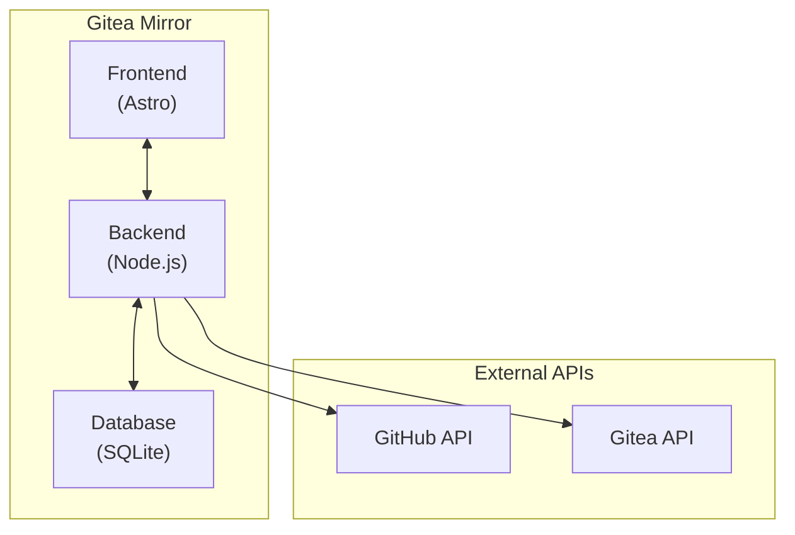

# Gitea Mirror Architecture

This document provides a comprehensive overview of the Gitea Mirror application architecture, including component diagrams, project structure, and detailed explanations of each part of the system.

## System Overview

Gitea Mirror is a web application that automates the mirroring of GitHub repositories to Gitea instances. It provides a user-friendly interface for configuring, monitoring, and managing mirroring operations without requiring users to edit configuration files or run Docker commands.

The application is built using:

- **Astro**: Web framework for the frontend
- **React**: Component library for interactive UI elements
- **Shadcn UI**: UI component library built on Tailwind CSS
- **SQLite**: Database for storing configuration and state
- **Node.js**: Runtime environment for the backend

## Architecture Diagram



## Component Breakdown

### Frontend (Astro + React)

The frontend is built with Astro, a modern web framework that allows for server-side rendering and partial hydration. React components are used for interactive elements, providing a responsive and dynamic user interface.

Key frontend components:

- **Dashboard**: Overview of mirroring status and recent activity
- **Repository Management**: Interface for managing repositories to mirror
- **Organization Management**: Interface for managing GitHub organizations
- **Configuration**: Settings for GitHub and Gitea connections
- **Activity Log**: Detailed log of mirroring operations

### Backend (Node.js)

The backend is built with Node.js and provides API endpoints for the frontend to interact with. It handles:

- Authentication and user management
- GitHub API integration
- Gitea API integration
- Mirroring operations
- Database interactions

### Database (SQLite)

SQLite is used for data persistence, storing:

- User accounts and authentication data
- GitHub and Gitea configuration
- Repository and organization information
- Mirroring job history and status

## Data Flow

1. **User Authentication**: Users authenticate through the frontend, which communicates with the backend to validate credentials.
2. **Configuration**: Users configure GitHub and Gitea settings through the UI, which are stored in the SQLite database.
3. **Repository Discovery**: The backend queries the GitHub API to discover repositories based on user configuration.
4. **Mirroring Process**: When triggered, the backend fetches repository data from GitHub and pushes it to Gitea.
5. **Status Tracking**: All operations are logged in the database and displayed in the Activity Log.

## Project Structure

```
gitea-mirror/
├── src/                  # Source code
│   ├── components/       # React components
│   ├── layouts/          # Astro layout components
│   ├── lib/              # Utility functions and database
│   ├── pages/            # Astro pages and API routes
│   └── styles/           # CSS and Tailwind styles
├── public/               # Static assets
├── data/                 # Database and persistent data
└── docker/               # Docker configuration
```
